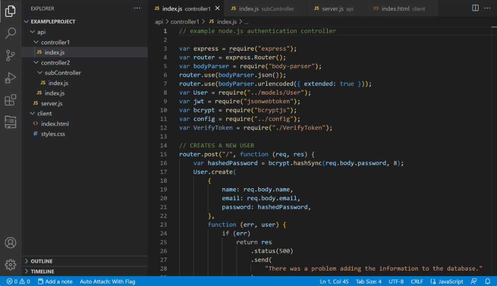
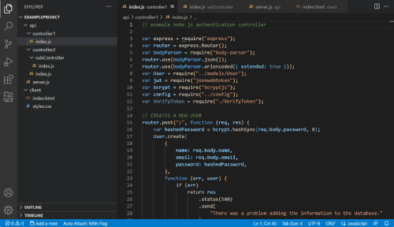
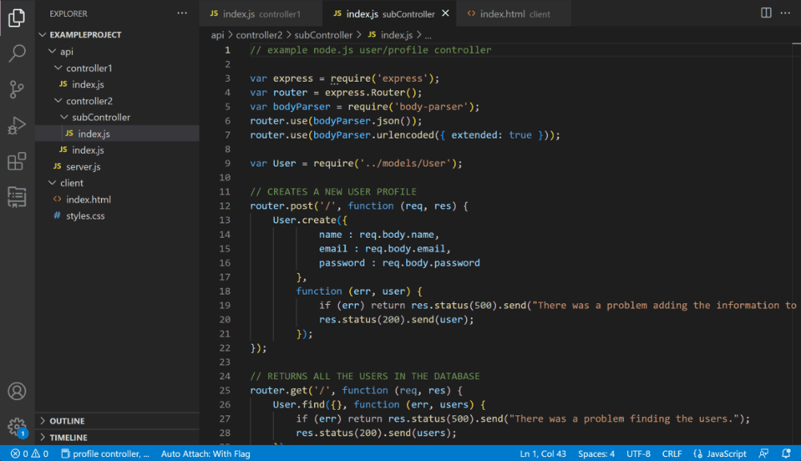

# TabNote - The ultimate way to leave notes on tabs and files

Leave a note on tabs or files to help you remember why they were opened/relevant/whatever the heck you may want to remember.

The main motivation behind this extension is to help you leave notes on a tab/file, this could be useful to remember why you opened a file (when you have too many open), or to leave a note to yourself about a file.

Notes persist across sessions, so you can leave a note on a file and come back to it later.

## Key Features

-   Quickly add a note to any file or tab
-   View preview of the note for current tab in the status bar at the bottom of the **window**
-   View and edit existing notes from the side bar (activity bar)
-   Search for a specific note through a quick pick menu

## How to use

-   To add a note for the current tab, use the command `TabNote: Add Note` or click the `Add Note` in the status bar
-   To view and edit existing notes, use the command `TabNote: View/Edit Note` or click the status bar button to view/edit the note for the current tab
-   To delete a note for the current tab, use the command `TabNote: Delete Note`
-   You can view and manage all notes by clicking the extension icon in the side bar (activity bar)
-   You can search for a note through the command `TabNote: Search Notes` or by clicking the search button in the status bar

In short, you can manage the notes in the workspace using status bar, activity bar or the command pallete

## Requirements

-   Visual Studio Code v1.50.0 or higher

## Extension Settings

This extension does not add any settings to Visual Studio Code yet.

## Known Issues

None at the moment.

## Release Notes

### 0.0.1

Initial release of TabNote

### 0.0.2 (upcoming)

Fix reported issues
